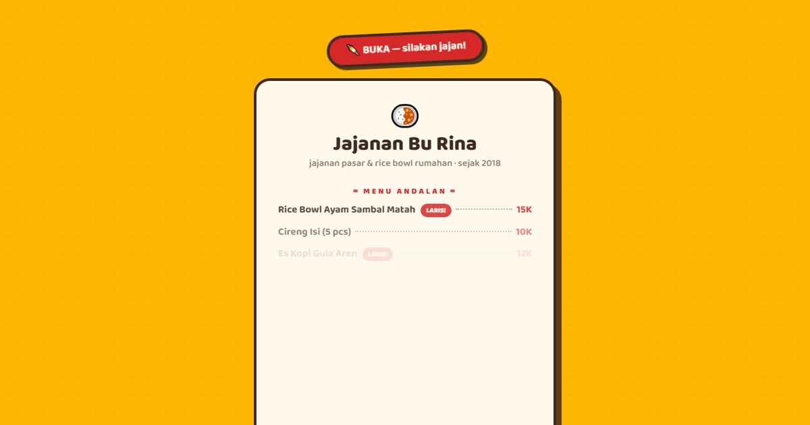

# Jajanan Bu Rina — Jajanan Pasar & Rice Bowl, Bandung

Tautan Jajanan Bu Rina di Bandung: papan buka/tutup menurut jam WIB, menu lengkap, menu baru mingguan, lokasi gerobak, serta PO snack box dan hampers untuk acara.

**Demo live:** https://linkinbio-jajan.vercel.app



> Template link-in-bio dengan persona fiktif. Akun, klien, harga, dan jadwal hanya contoh; tautan utama menuju halaman dalam yang benar-benar ada, dan formulir tidak mengirim data.

## Konsep

Persona Jajanan Bu Rina, jajanan kaki lima. Papan menu warung dengan titik penuntun harga, lencana LARIS, dan papan BUKA yang berayun.

## Halaman

- `/` — papan OPEN/TUTUP bergoyang mengikuti jam WIB, papan menu andalan, tombol pesan bergaya stiker
- `/menu` — papan menu empat kategori dengan titik-titik harga, menu baru, lokasi & jam
- `/pesan` — PO tiga paket dengan minimal pesanan, tanggal paling cepat H-2, total

## Teknologi

- Next.js 15.5 (App Router) dan React 19
- Tailwind CSS v4
- JavaScript
- Framer Motion, Lucide (ikon)
- Font: Baloo 2 (next/font)
- SEO: metadata per halaman, Open Graph, JSON-LD, sitemap.xml, dan robots.txt

## Menjalankan secara lokal

```bash
npm install
npm run dev
```

Buka http://localhost:3000. Untuk build produksi: `npm run build` lalu `npm start`.

---

Bagian dari koleksi 12 template link-in-bio di [PortalBio](https://www.pintuweb.com/link-in-bio). Dibuat oleh [PintuWeb](https://www.pintuweb.com), jasa pembuatan website.
